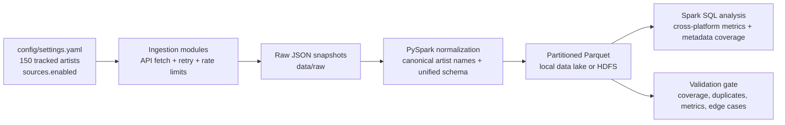

# Artist Popularity Pipeline Across Music Platforms

**CS 4265 Big Data Analytics**  
Elijah Giusto

This project is a PySpark data pipeline that compares artist popularity and metadata across public music and web data sources. It ingests 150 configured artists, normalizes heterogeneous API responses into one schema, stores partitioned Parquet snapshots in local mode or HDFS mode, runs Spark SQL analysis, and validates data quality on every run.

In 30 seconds: the pipeline answers, "How does an artist's reach differ across listener counts, fan counts, public page attention, open listening stats, community ratings, and catalog metadata?"

## Current Sources

| Source | Auth | Pipeline Role |
| --- | --- | --- |
| Last.fm | Free API key | Listener count, playcount, tags |
| Deezer | No key | Fan count and artist catalog data |
| MusicBrainz | No key | MBID, community rating, tags |
| ListenBrainz | No key | Open listen-count stats by MusicBrainz artist ID |
| Wikimedia Pageviews | No key | Rolling monthly Wikipedia pageview attention metric |
| TheAudioDB | Free shared/API key | Artist genre/style metadata |
| iTunes Search | No key | Apple catalog ID and primary genre |
| Wikidata | No key | Canonical entity ID and genre claims |

Spotify remains in the codebase as an optional catalog-ID source, but it is disabled by default because current development-mode responses do not provide useful artist popularity, follower, or genre metrics.

## Architecture



## Repository Layout

```text
.
|-- config/
|   |-- artists_150.yaml
|   `-- settings.yaml
|-- docker/
|   `-- hadoop/
|-- data/sample/artist_popularity_sample.json
|-- docs/
|   |-- architecture.md
|   |-- data_dictionary.md
|   |-- hdfs.md
|   `-- validation.md
|-- src/
|   |-- analysis/queries.py
|   |-- ingestion/
|   |-- processing/normalize.py
|   |-- storage/parquet_store.py
|   `-- validation/validate.py
|-- tests/
|-- .env.example
|-- README.md
`-- requirements.txt
```

## Setup

### Prerequisites

- Python 3.9+; tested locally with Python 3.14.3
- Java 17 for PySpark
- Docker Desktop for optional HDFS mode
- Windows only: `hadoop/bin/winutils.exe` and `hadoop/bin/hadoop.dll`

### Clone

```bash
git clone https://github.com/ElijahGiusto/Big-Data-Analytics-Project.git
cd Big-Data-Analytics-Project
```

### Install

```bash
python -m pip install -r requirements.txt
```

### Configure Credentials

```bash
cp .env.example .env
```

Fill in:

```text
LASTFM_API_KEY=your_lastfm_api_key
```

Last.fm is the only required private key for the default run. Spotify credentials are optional because Spotify is disabled by default in `config/settings.yaml`. Deezer, MusicBrainz, ListenBrainz, Wikimedia, iTunes, and Wikidata require no private credentials. TheAudioDB uses the documented free key in `config/settings.yaml`, with optional override through `THEAUDIODB_API_KEY`.

## Run Locally

```bash
# Full pipeline: ingest, normalize, store, query, validate
python src/main.py

# Query existing Parquet without new ingestion
python src/main.py --query-only

# Run only the validation gate
python src/main.py --validate-only

# Run without validation, useful during API debugging
python src/main.py --skip-validation
```

## Run With HDFS

The default mode writes processed Parquet to `data/processed` so the project is easy to clone and run. For a real Hadoop-backed run, start the bundled single-node HDFS service and use `--storage hdfs`:

```bash
docker compose up -d --build
python src/main.py --storage hdfs
```

Useful HDFS commands:

```bash
# Query existing HDFS Parquet without new API calls
python src/main.py --query-only --storage hdfs

# Validate existing HDFS Parquet
python src/main.py --validate-only --storage hdfs

# Inspect the HDFS directory from the container
docker compose exec hdfs hdfs dfs -ls -R /artist-popularity/processed

# Stop the local Hadoop service
docker compose down
```

NameNode UI: [http://localhost:9870](http://localhost:9870)

See [docs/hdfs.md](docs/hdfs.md) for HDFS inspection, reset, and troubleshooting commands.

## Validation Evidence

Latest successful run: **April 26, 2026**

- Runtime: **581.7 seconds**
- Latest snapshot rows: **1,162**
- Historical rows loaded: **1,320**
- Sources present in latest snapshot: **8 enabled sources**
- Canonical artists: **150/150**
- Duplicate artist-platform-date groups: **0**
- Required metric platforms populated: Last.fm, Deezer, MusicBrainz, Wikimedia
- Validation result: **passed**

See [docs/validation.md](docs/validation.md) for the full validation report and edge cases.

## Key Technical Decisions

- **PySpark over pandas-only processing:** keeps the project aligned with distributed data pipeline concepts and supports scalable SQL queries over partitioned snapshots.
- **Local or HDFS Parquet:** stores data by `platform` and `snapshot_date`, enabling efficient platform/time filtering and incremental snapshots. Local mode is the clone-and-run default; HDFS mode uses Dockerized Apache Hadoop.
- **Canonical artist matching:** normalizes platform spelling variants such as `Björk`, `TOOL`, `Tyler, The Creator`, and `King Gizzard & The Lizard Wizard` back to the configured artist list.
- **Snapshot partition cleanup:** rerunning the same day replaces the current snapshot before writing, so disabled sources like Spotify cannot remain in the latest partition.
- **Spotify treated honestly:** Spotify is disabled by default because the available development-mode API response omits artist popularity/follower/genre fields.
- **Rate-limit-aware enrichment:** iTunes runs sequentially with caching because Apple documents the Search API at about 20 calls per minute.

## Known Limitations

- MusicBrainz and ListenBrainz depend on MBIDs, so artists with missing MusicBrainz matches have partial coverage.
- Metrics are platform-native and not directly equivalent: Last.fm listeners, Deezer fans, Wikimedia pageviews, ListenBrainz listens, and MusicBrainz ratings measure different forms of attention.
- TheAudioDB and iTunes are enrichment sources; they improve metadata coverage but are not popularity sources.
- Public APIs can change or rate-limit; ingestion modules include retries, throttling, and partial-failure handling.

## Tests

```bash
python -m unittest discover -s tests
python src/main.py --validate-only
```
