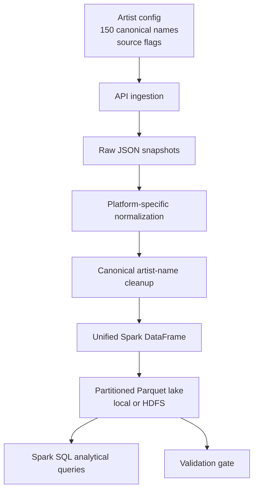

# Architecture

## Purpose

The pipeline builds a repeatable artist-level dataset from several music and public web data sources. It is designed around batch snapshots: each run captures the current state of all configured artists, normalizes the records, appends or replaces the current date partition, and validates the result.

## Data Flow



## Ingestion Layer

Each source lives in its own module under `src/ingestion`. Modules implement:

- API request construction
- retry/backoff handling
- source-specific rate limiting
- raw JSON persistence
- partial failure handling so one source does not stop all ingestion

The default pipeline uses eight enabled sources: Last.fm, Deezer, MusicBrainz, ListenBrainz, Wikimedia Pageviews, TheAudioDB, iTunes Search, and Wikidata. Spotify remains available in the codebase as an optional catalog-ID source, but it is disabled by default because current development-mode responses do not provide useful artist popularity metrics.

Independent sources run concurrently at the source level. MusicBrainz and iTunes still protect their public APIs with strict per-request throttles, and ListenBrainz runs after Last.fm/MusicBrainz because it depends on MusicBrainz artist IDs.

## Processing Layer

`src/processing/normalize.py` maps each raw source shape into the shared `artist_popularity` schema. Artist names are canonicalized against `config/settings.yaml` so API variants such as `Björk`, `TOOL`, and `Tyler, The Creator` group correctly.

## Storage Layer

`src/storage/parquet_store.py` writes Snappy-compressed Parquet partitioned by:

```text
platform
snapshot_date
```

The default storage mode writes to local `data/processed` for easy clone-and-run use. HDFS mode writes the same partitioned Parquet layout to `hdfs://localhost:9000/artist-popularity/processed` through a Dockerized Apache Hadoop NameNode/DataNode service.

This supports efficient source-specific queries, historical trend analysis, and safe reruns. Same-day reruns remove existing partitions for the current snapshot date before writing, which prevents disabled sources from remaining in the latest snapshot. Local mode removes partitions with filesystem operations; HDFS mode removes them through Hadoop's FileSystem API.

HDFS mode can be started with:

```bash
docker compose up -d --build
python src/main.py --storage hdfs
```

## Query Layer

`src/analysis/queries.py` registers the Parquet dataset as a Spark SQL temp view and runs:

- artist scorecard across real metric sources
- percentile-normalized composite reach ranking
- platform gap analysis for artists that rank differently by source
- genre reach summary
- metadata coverage for enrichment sources
- artist profile across enabled sources

## Validation Layer

`src/validation/validate.py` checks the latest snapshot for:

- required columns
- non-null key fields
- 150/150 canonical artist count
- no names outside config
- no duplicate artist-platform-date rows
- required metric source coverage
- non-negative metrics
- bounded 0-100 scores for bounded sources

The validation gate runs automatically after the full pipeline and can be run independently with:

```bash
python src/main.py --validate-only
```
